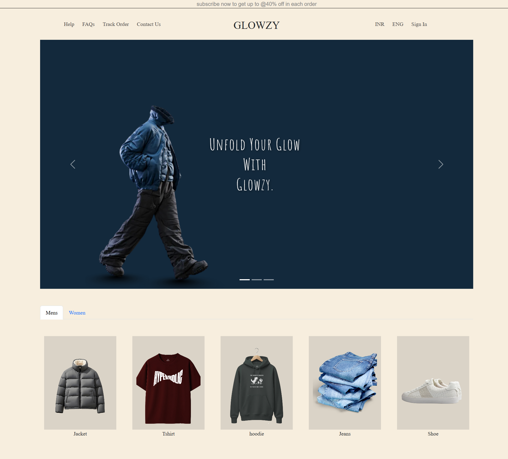
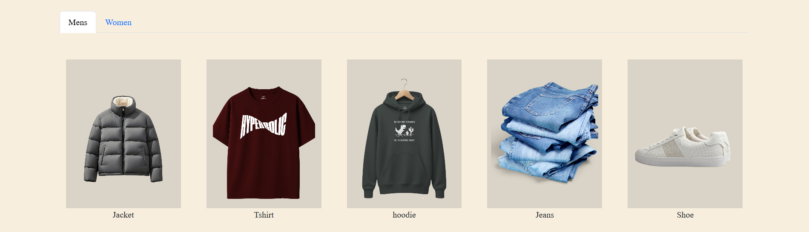
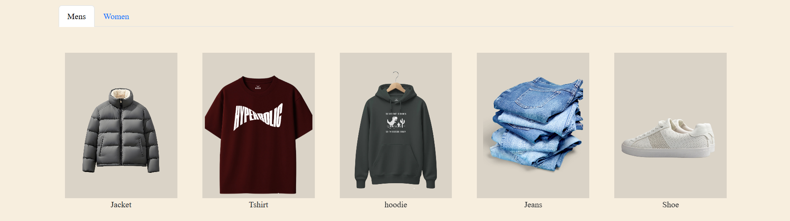
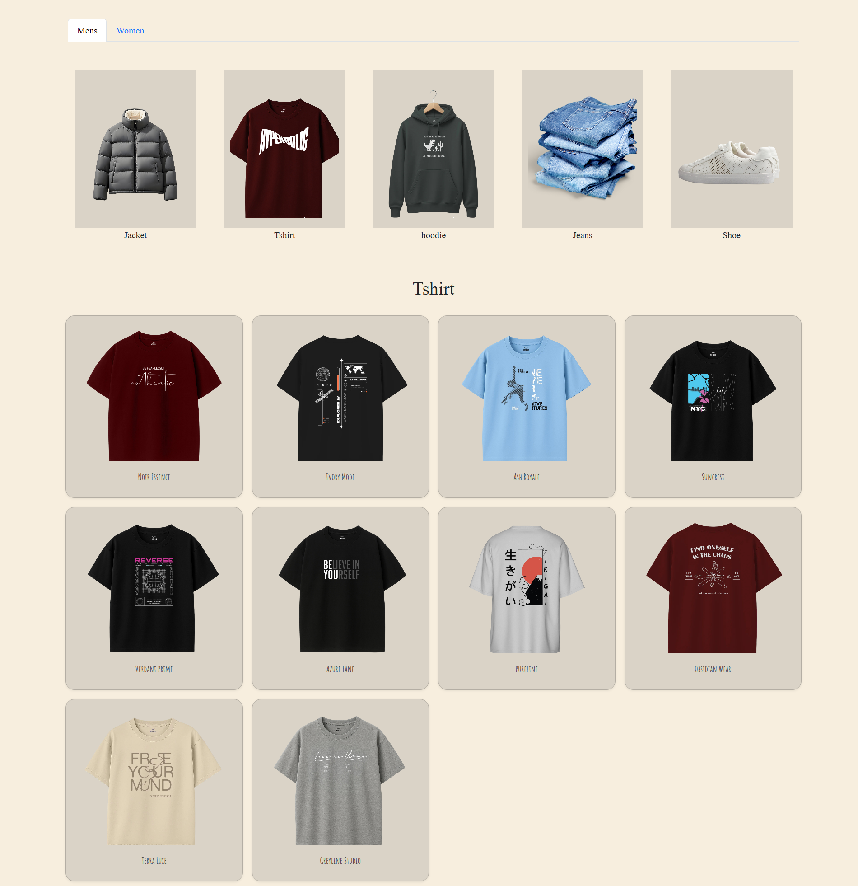
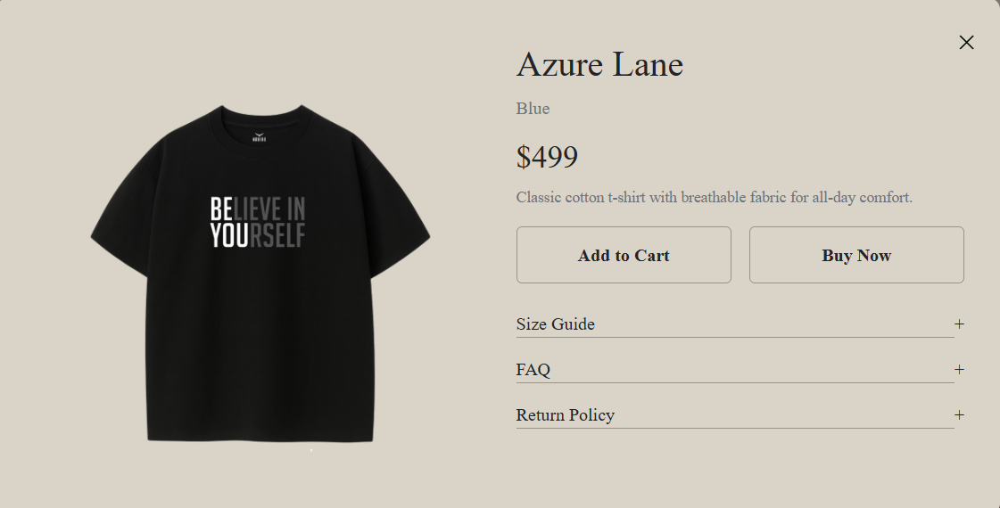

# ✨ GLOWZY – Fashion E-Commerce Website

GLOWZY is a modern and elegant fashion e-commerce website designed to deliver a smooth shopping experience with clean UI, product previews, and interactive components.

---

## 🌐 Live Demo
👉 https://gloowzy.vercel.app/

---

## 🖼️ Project Preview

### 🏠 Home Page

---

### 🧭 Category Section (Men / Women)

---

### 👕 Product Listing

---

### 🛍️ Product Details Modal

---

## 📌 Features

### 🛒 Shopping Experience
- Men & Women category tabs
- Clean product cards with images
- Product modal with full details

### 📄 Product Modal Includes
- Large product preview
- Product name & color
- Price display
- Description
- Add to Cart
- Buy Now
- Size Guide
- FAQ
- Return Policy

### 🎞️ Hero Banner
- Modern slider design
- Brand-focused tagline
- Smooth navigation controls

### 📱 Responsive UI
- Mobile-friendly design
- Adaptive product grids
- Clean spacing & typography

---

## 🧰 Tech Stack

### Frontend
- HTML5
- CSS3
- JavaScript (Vanilla)

### Deployment
- Vercel

---

## 📂 Project Structure

